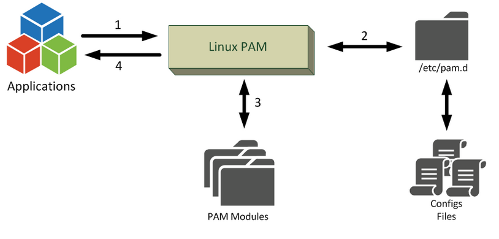

# PAM
Linux Pluggable Authentication Modules (PAM) is **a suite of libraries that allows a Linux system administrator to configure methods to authenticate users**

## Create Home Directories during login
`etc/security`   (modules and configs we could change to configure policies)
`sudo vi /etc/login.defs`   (control if Home directory is created when user added or not)

To Automate Creation of home directory
`sudo yum install oddjob`
`systemctl enble oddjob && systemctl start oddjob`
`sudo authconfig --enablemkhomedir --update`
___________________________

## Configure Password Policies
`/etc/pam.d/system-auth`  (shows password policies)
pam.d has config files for auth program

`/etc/security` (directory has auth files for modules)

`pwscore` to check your password strength against dictionary words.

## Restrict Consecutive logins and resource access

`ulimit -u 10`   (restricr to 10 process running simultaneously)
`sudo vi /etc/security/limits.conf`

@users soft nproc 50
@users hard nproc 75

(no of processes < 50 for soft limit and < 75 top)
(users cant use ulimit to go beyond the hard limit you setted)

## Control login times
- `sudo vi /etc/pam.d/sshd`   (to control login times or whatnot)
	- `/etc/security/time.conf`  (to implement the time restrection)
	- sshd;*;user1|user2;Wk0800-1800   (example of time.conf added restriction)